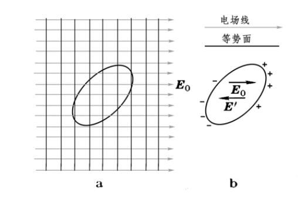

# 二维尖角导体

对于二维尖角导体，如果其表面分布有一定的电荷的话，电荷会重新排布使得导体变为等势体，下面研究这样的模型，导体达到静电平衡，没有外电场，假设尖角的下侧为导体内部，也就是 $\theta>\theta_0$ 的区域，而对于 $\theta<\theta_0$ 的区域，电场发生变化，电势可以通过拉普拉斯方程求解。而我们感兴趣的只是在尖角处，电荷面密度是怎么分布的。这个问题等价于：在尖角附近，电场是怎么分布的？

有趣的是，对于这种情况的计算可以以特例的形式说明：电荷在导体表面倾向于分布在表面曲率为正的地方，总体上：$\rho_{positive}>\rho_{zero}>\rho_{negative}$，即电荷密度：正曲率>零曲率>负曲率。

## 方程求解

假设尖角大小为 $\theta_0$，因此，我们的研究区域为 $0 < \theta < \theta_0, \rho>0$。二维区域的含义是导体沿z轴方向具有平移不变性，也就是“无限长折角沟槽”的形状。

空间中电势满足拉普拉斯方程：

$$\nabla^2V(\rho, \theta)=0$$

在柱坐标系下，拉普拉斯算子可以写成如下形式：

$$\nabla^2V(\rho, \theta) = \frac{1}{\rho}\frac{\partial}{\partial\rho}\left(\rho\frac{\partial V}{\partial\rho}\right)+\frac{1}{\rho^2}\frac{\partial^2V}{\partial\theta^2}$$

代入拉普拉斯方程，分离变量可以解得方程的级数解：

$$V(\rho, \theta)=a_0+b_0ln(\rho)+\sum_{k}\rho^k(a_ksin\,k\theta + b_kcos\,k\theta)$$

考虑到边界条件为：$V(\rho, 0),\,V(\rho, \theta_0)$与$\rho$无关，因此有：

$$sin\,k\theta_0=0$$

化简得到：$k=\frac{n\pi}{\theta_0}$，代入方程的解。又考虑到电势在 $\rho=0$处不发散（因为尖角没有线电荷），电势选取与零点有关，故方程的解化简为：

$$V=\sum_{n=1}^{\infty}A_n\rho^{n\pi/\theta_0}sin\left(\frac{n\pi\theta}{\theta_0}\right)$$

## 分析与讨论：

在 $\rho$ 非常小时，只有一阶近似项被保留下来了，因此：

$$V=A_1\rho^{\pi/\theta_0}sin\left(\frac{\pi\theta}{\theta_0}\right)$$

